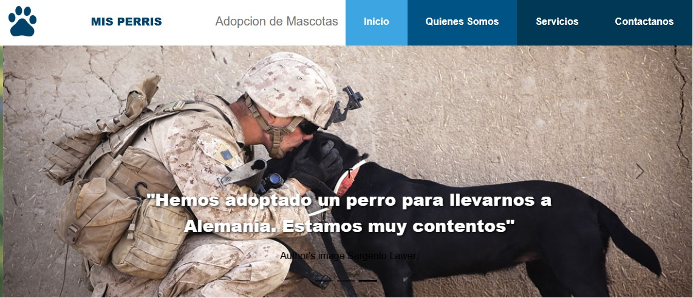
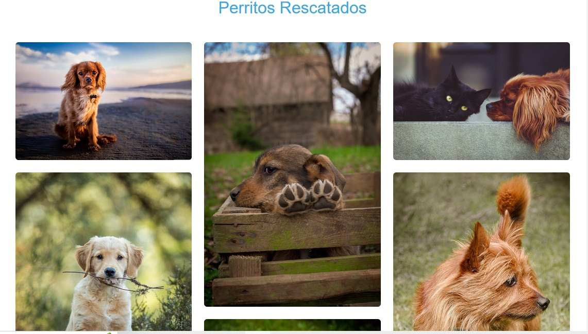
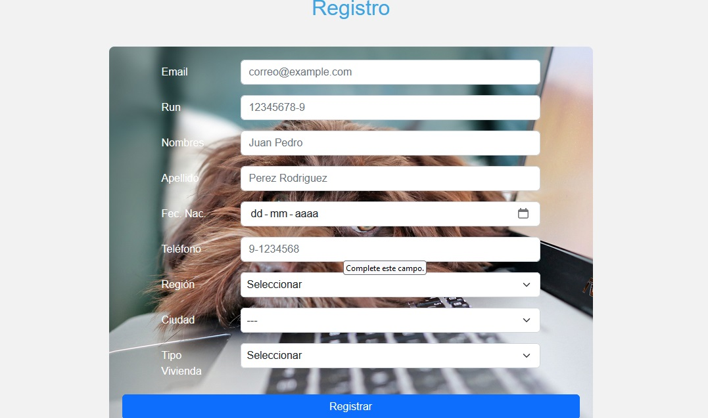

# Fundación de Rescate de Mascotas

Bienvenido a la página web de nuestra Fundación de Rescate de Mascotas. Nuestra misión es encontrar hogares amorosos para perros abandonados. En este sitio, podrás conocer a nuestras mascotas disponibles para adopción, leer testimonios de familias adoptantes y registrarte para adoptar un perro.

## Requisitos del Proyecto

### Funcionalidades

1. **Portada del Sitio**
   - **Carrusel de Imágenes**: Muestra imágenes de mascotas que han sido reubicadas exitosamente.
   - **Testimonios**: Incluye un pequeño testimonio de la familia que adoptó cada mascota.

   
   *Ejemplo de carrusel con mascotas adoptadas*

2. **Galería de Imágenes**
   - Muestra imágenes de los perros que la Fundación ha rescatado y que necesitan un nuevo hogar.
   - Cada imagen debe ir acompañada del nombre del perro y una breve reseña sobre sus características físicas y/o personalidad.

   
   *Galería de perros rescatados*

3. **Formulario de Registro de Nuevos Usuarios**
   - **Datos Requeridos**:
     - **Correo Electrónico**: Requerido, formato válido.
     - **RUN**: Requerido, formato de RUN chileno.
     - **Nombre Completo**: Requerido, solo letras.
     - **Fecha de Nacimiento**: Requerido, año anterior a 2001.
     - **Teléfono de Contacto**: Solo números.
     - **Región**: Requerido, selección desde lista desplegable.
     - **Ciudad**: Requerido, selección desde lista desplegable.
     - **Tipo de Vivienda**: Requerido, selección desde lista desplegable con opciones:
       - Casa con patio grande
       - Casa con patio pequeño
       - Casa sin patio
       - Departamento
   - **Validaciones**: Implementadas con HTML y/o JavaScript.
   - **Responsividad**: El formulario debe ser visible y funcional en dispositivos móviles y de escritorio.
   - **Estilo**: Aplicación de estilos CSS para asegurar una apariencia acorde al resto del sitio.

   
   *Formulario de registro de nuevos usuarios*

4. **Menú y Redes Sociales**
   - Un menú de navegación que acceda a las diferentes secciones de la página.
   - Enlaces a al menos dos redes sociales.

## Estructura del Proyecto

### Archivos

- **index.html**: Página principal del sitio.
- **styles.css**: Hoja de estilos CSS.
- **scripts.js**: Archivo JavaScript para validaciones y funcionalidades dinámicas.

